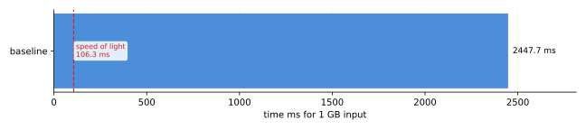

# The Baseline

## Speed of Light

From our definition of optimization, we know that the theoretical limits must
first be established. For applications, there are two types of work that can be
optimized.

- Instruction execution: The count and type of instructions executed. This includes
  arithmetic and pipelining.
- Data transfer: Parameters to intruction execution moving to and from storage.
  This includes network access, local storage, system memory, and process memory.

For `rot13`, the work is to process data using a transform function. It reads every
input byte once and writes every output byte once. We know the input will come from a
user which means data is at best sourced from RAM. This makes the application 
memory-bandwidth-bound. No amount of CPU optimization can make it faster than the rate
at which memory can supply and absorb data. 

Measure the achievable read+write bandwidth on your machine:

```bash
./tools/bw-probe.sh
```

```
best memcpy 1 GB:          0.106 s
read+write bandwidth:      20.2 GB/s
rot13 speed-of-light:      106.3 ms  (1 GB input, 1 read + 1 write)
```

106.3 ms is the floor. Any implementation that processes 1 GB slower than that is leaving
performance on the table; any implementation that matches it has extracted everything the
hardware can give. 

## Measure Once then Measure Again

Before touching your application, measure the actual performance. There are many
open-source tools available for making quick and accurate work of this task. 
Benchmarking is a notoriously difficult task on modern systems with complex,
dynamic CPU and memory architectures. Use off-the-shelf tools to get the most
accurate results before attempting to roll you own.

Remember to minimize system load while working through these exercises.

### The Baseline

Record the baseline with `perf stat`, saving the output for later comparison:

```bash
# Configure and build the programs
cmake -S . -B build -DCMAKE_BUILD_TYPE=Benchmark
cmake --build build

# Generate the baseline using a wrapper for `perf stat`
./tools/run-perf.sh -o results/baseline_perf.txt -- ./build/cmd/rot13-cli -f data/data_1GB.txt --bench
```

### Reading the `perf stat` Output

The metadata header written by `run-perf.sh` captures the environment -- OS, CPU, pinned cores,
compiler, and governor -- so every result is reproducible and comparable. Below it, `perf stat`
reports hardware performance counters. Here is what each field means using `baseline_perf.txt`
as the reference:

| Field | Baseline value | What it measures |
|---|---|---|
| `cpu_core/cycles/u` | 7,490,870,768 | CPU clock cycles consumed in user space. Divide by your clock frequency to get CPU-time; compare across runs to track overall work. |
| `cpu_core/instructions/u` | 28,260,177,542 | Retired instructions in user space. The ratio `instructions/cycles` is IPC (instructions per cycle); higher is better. |
| `cpu_core/mem_load_retired.l1_miss/u` | 41,104 | Load instructions that missed L1 cache. Near zero here because the working set is streamed sequentially and the prefetcher handles it. |
| `cpu_core/mem_load_retired.l2_miss/u` | 3,808 | Load instructions that missed both L1 and L2. Also near zero for the same reason. |
| `cpu_core/mem_load_retired.l3_miss/u` | 1,200 | Load instructions that missed all three cache levels and went to DRAM. Low here despite 1 GB input because the hardware prefetcher fills cache lines ahead of the sequential scan. |
| `cpu_core/dtlb-load-misses/u` | 580 | [TLB][tlb] misses on load addresses. Low because the input is a single contiguous allocation; the OS maps it with a small number of large pages. |
| `cpu_core/dtlb-loads/u` | 1,682,340,562 | Total [TLB][tlb] lookups for loads. The miss rate `dtlb-load-misses / dtlb-loads` is effectively 0%, confirming translation is not a bottleneck. |
| `page-faults:u` | 988 | User-space [page faults][pagefault] (soft faults on first touch). Proportional to the allocation size; not a per-iteration cost once the run is underway. |
| `cpu_core/branches/u` | 62,383,554 | Conditional and unconditional branches executed. Roughly one branch per ~16 bytes of input, the inner loop condition. |
| `cpu_core/branch-misses/u` | 196 | Branches where the predictor was wrong. Near zero: the loop body is perfectly predictable. |
| `cpu_core/uops_issued.any/u` | 28,187,546,428 | Micro-ops issued by the front end. Should be close to `uops_retired.slots`; a large gap would indicate the back end is stalling. |
| `cpu_core/uops_retired.slots/u` | 28,216,153,170 | Micro-ops that completed execution. Matches `uops_issued` closely, meaning almost no speculative work was discarded. |
| `time elapsed` | 2.153 s | Wall-clock time including startup. Noisy for single-shot runs; use `hyperfine` for reliable timing. |
| `user` | 1.835 s | Time spent in user-space code. The bulk of elapsed time is algorithm and I/O buffering. |
| `sys` | 0.297 s | Time spent in kernel code on behalf of the process. Dominated by `read()` syscalls bringing 1 GB off disk into page cache. |

The `<not counted>` rows are `cpu_atom` events on the E-core PMU. Those cores are excluded by the
`taskset 0-3` pinning, so their counters never increment. The `<not supported>` rows
(`stalled-cycles-frontend/backend`) require additional MSR access that this kernel configuration
does not expose.

## What the Baseline Tells Us

**We see high IPC (`28.26B instructions / 7.49B cycles ~= 3.77`)**, so this means the core's
execution units are well-fed and retirement is smooth. A common prescription is to reduce
front-end pressure by merging micro-ops; for example, consolidating the two branch arms into
a [cmov][cmov]. That does not help here because the predictor is already near-perfect (196 misses
across 62 million branches), so there is no misprediction penalty to recover. High IPC with
fast wall-clock time is healthy; high IPC with slow wall-clock time, as we see here, just means
the CPU is efficiently executing the wrong amount of work.

**We see ~28 billion micro-ops to process 1 GB of input**, so this means roughly 28
instructions per byte. That is the real problem: the scalar loop does far too much work per
byte (two range comparisons, two conditional branches, subtract, modulo, add) and no
amount of branch or pipeline tuning changes that ratio. The fix is to process more bytes per
instruction, which is what SIMD does.

**We see negligible cache misses (1,200 L3 misses across 1 GB)**, so this means the hardware
prefetcher is keeping up with the sequential scan. A standard prescription for high miss counts
is to add software prefetch hints (`__builtin_prefetch`). That would be wasted effort here as
the prefetcher is already doing its job. Verifying this before reaching for prefetch hints is
exactly the point of reading the counters first.

**We see `sys` time at 0.297 s (14% of elapsed)**, so this means `read()` syscalls are a
secondary but real cost; the file is being copied from the kernel's page cache into our
`malloc` buffer. Replacing `fread` with `mmap` eliminates that copy. Whether it moves the
needle enough to matter depends on how much we close the gap on the compute side first.

[tlb]: https://en.wikipedia.org/wiki/Translation_lookaside_buffer
[cmov]: https://www.felixcloutier.com/x86/cmovcc
[pagefault]: https://en.wikipedia.org/wiki/Page_fault


## CPU Affinity

Both `run-perf.sh` and `flame.sh` pin the process to cores `0-3` via `taskset`. On this
machine (i7-1255U) those are the two P-cores, which keeps the process off the E-cores and
prevents the scheduler from migrating it mid-run. On a different machine the core numbering
will differ; check `lscpu` and override with `TASKSET_CORES=<range>` if needed:

```bash
TASKSET_CORES=0-3 ./tools/run-perf.sh ...
```

> perf uses CPU-specific hardware counters. The events in `run-perf.sh` target Intel's PMU:
> `mem_load_retired.*`, `uops_issued.any`, and `uops_retired.slots` are Intel names and will
> not exist verbatim on AMD or ARM. If you see "event not found" errors, run `perf list` to
> see what your CPU exposes and update the `EVENTS` variable in `run-perf.sh` accordingly.
> `cycles`, `instructions`, `branches`, `branch-misses`, and `page-faults` are generic and
> work everywhere.

## Stdout and Measurement Noise

The binary writes its result to stdout, which adds cost that has nothing to do with the
algorithm. Redirecting to `/dev/null` eliminates the kernel-side `write()` cost, but the
user-space work, buffering and copying the output into stdio's internal buffer, still runs
and still appears in `perf stat`'s `:u` counters. To truly isolate the computation, suppress
output entirely with `--bench`. The `:u` suffix on perf events is a useful reminder: it only
counts user-space work, so stdout overhead shows up there regardless of where the output goes.

### Our First Datapoint

Compare the instruction counts with and without `--bench`. Without it, `fputs` copies 1 GB
through stdio's internal buffer, a user-space memcpy that adds millions of instructions to
the `:u` counter, none of which belong to the algorithm. With `--bench` those instructions
disappear and the counter reflects only `rot13_process` and its supporting work.

This is not an optimization, the binary is not faster at its actual job. It is measurement
hygiene: making sure the numbers describe the thing being studied. Every benchmark involves
this kind of scoping decision. Getting it wrong doesn't corrupt the result catastrophically,
but it adds noise that can obscure real differences between implementations, especially when
those differences are small.


## Flame Graph

To produce a flame graph and get per-instruction annotation:

```bash
./tools/flame.sh -n baseline -- ./build/cmd/rot13-cli -f data/data_1GB.txt --bench
# produces results/baseline_flame.svg and perf-out/baseline.data
# per-instruction breakdown (--stdio avoids libcapstone requirement):
# perf annotate --stdio -i perf-out/baseline.data
```

For a tight single-function loop like this, the flame graph will show `rot13_process` dominating
unconditionally. The interesting question is _which instructions within it_ are slow. That is what
`perf annotate --stdio` answers: it interleaves source lines with sampled instruction counts, showing
exactly where cycles are going inside the function.

## Progress Chart

`perf stat` runs the command once with no warmup, so its wall-clock time is noisy. Use
`hyperfine` instead: it does warmup runs and reports mean, stddev, and min across many
iterations, making small improvements reliably detectable. Export to JSON so `plot-results.py`
can pick it up automatically. Name each file `<label>_hyperfine.json`:

```bash
hyperfine --warmup 3 --export-json results/new_optimization_hyperfine.json \
  './build/cmd/rot13-cli -f data/data_1GB.txt --bench'
# --sol is speed-of-light from bw-probe.sh output
python3 tools/plot-results.py --sol 106.3 --results results/ --out results/chart.svg
```



## Summary

We have established our speed-of-light (106 ms on this system) and our scalar baseline (2153 ms),
a gap of roughly 20x. System-specifics like P-core affinity, CPU governor, and compiler version
are captured in the metadata header written by `run-perf.sh`, so every result is tied to a known
environment and regressions are traceable to a specific change.

From here, each optimization attempt follows the same loop: implement, confirm with `hyperfine`,
profile with `perf stat` and `perf annotate`, add to the progress chart. The 106 ms floor is the
target; anything that reaches it has extracted everything the hardware can give.
