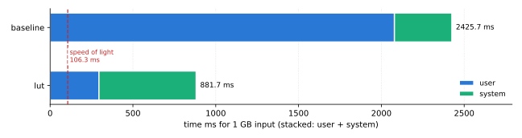

# Low Hanging Fruit

In Chapter 2 we used `perf` to identify candidates for optimization. IPC is
already near its ceiling, so there's no headroom to gain by executing
instructions more efficiently. The remaining lever is doing less per byte in
the first place. That comes in two forms:

- Fewer instructions for the same work. A lookup table replaces branch-and-arithmetic with a single load. 
- More work per instruction. SIMD processes many bytes per retired instruction instead of one.

Both reduce total instruction count.

Writing a look up table (LUT) is significantly easier to implement that SIMD.
The trade off with a LUT is the extra resource consumption. That data has to live
_somewhere_ and that means a larger binary size and probably more RAM usage. Since
we're not optimizing for size or resources, this is a fair tradeoff.

## LUT

The `rot13` translation is an ideal LUT candidate. Each byte maps to exactly one
other byte. We have already defined the input domain as ASCII so we only need 6 bits.
Since we're not optimizing for storage space, we'll over-allocate our bits and use
`uint8_t` as our table type.

The table is generated once, ahead of time, by applying the same branch-and-arithmetic
logic from Chapter 2 to every possible byte value and recording the result:

```
for byte in 0..255:
    if byte in 'a'..'z':
        table[byte] = 'a' + (byte - 'a' + 13) % 26
    else if byte in 'A'..'Z':
        table[byte] = 'A' + (byte - 'A' + 13) % 26
    else:
        table[byte] = byte
```

The runtime cost of the branches and modulo is paid exactly once, at table-generation
time, instead of once per input byte. See [rot13_table.c](../../src/rot13_table.c) for
the generated table and [rot13_lut.c](../../src/rot13_lut.c) for the lookup itself.

## Results

`perf stat` on the LUT build (`results/lut_perf.txt`) confirms the prediction from Chapter 2:
cutting instructions-per-byte was the lever, and it moved.

| Field | Baseline | LUT | Change |
|---|---|---|---|
| `cpu_core/cycles/u` | 7,490,870,768 | 1,138,221,410 | 6.6x fewer |
| `cpu_core/instructions/u` | 28,260,177,542 | 6,004,558,237 | 4.7x fewer |
| instructions / byte | 26.3 | 5.6 | 4.7x fewer |
| IPC (`instructions/cycles`) | 3.77 | 5.28 | higher |
| `cpu_core/branch-misses/u` | 196 | 16 | fewer |

Branch count itself (`cpu_core/branches/u`) actually rises, from 62.4M to 1.00B, because the
baseline's two-armed comparison compiled down to a small number of vectorizable compares, while
the LUT's simplest form is a scalar loop with one loop-branch per byte. That branch is almost
perfectly predicted with 16 misses across 1.00B branches, so the extra branch count costs
essentially nothing while the removed arithmetic and modulo pay for themselves many times over:
fewer instructions per byte, fewer cycles overall, and a higher IPC than the baseline already
had.

`perf stat` runs the command once with no warmup, so its wall-clock time is noisy. Use
`hyperfine` instead because it does warmup runs and reports mean, stddev, and min across many
iterations. This makes it possible to reason about small improvements. Export to JSON so `plot-results.py`
can pick it up automatically. Name each file `<label>_hyperfine.json`:

```bash
hyperfine --warmup 3 --export-json results/lut_hyperfine.json \
  './build/cmd/rot13-cli -f data/data_1GB.txt --bench'
# --sol is speed-of-light from bw-probe.sh output
python3 tools/plot-results.py --sol 106.3 --results results/ --out results/lut_chart.svg
```



`hyperfine` confirms the counter-level improvement shows up in wall-clock time. Over 10
warmed-up runs:

- `baseline_hyperfine.json` reports a mean of 2.448 s
    - user 2.079 s, system 0.347 s
- `lut_hyperfine.json` reports a mean of 0.886 s
    - user 0.295 s, system 0.587 s

This is a 2.8x reduction in total time, but a 7.0x reduction in user time alone, in line with the 6.6x
drop in raw cycles. The wall-clock speedup lags the compute speedup because system time does not shrink
with the algorithm, so it eats a larger share of an already-smaller runtime. This could be caused by
kernel work such as page-fault handling for the ~1 GB output buffer. The LUT build is still well
short of the 106.3 ms speed-of-light floor, so there is more to extract.
