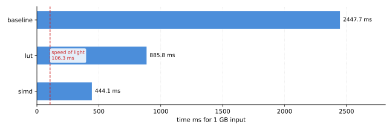

# Embarrassingly Parallel

In Chapter 2, we identified two plausible courses of action:

1. Execute fewer instructions
2. Do more work per instruction

The look up table approach helped us minimize the number of instructions required to complete
the same amount of work. THat leaves us with the task of doing more work per instruction.

The `rot13` algorithm just so happens to be a textbook candidate for SIMD. Every output byte
depends only on the input byte at the same position. Nothing carries across the calculation loop.
Problems shaped like this are called *embarrassingly parallel*. Parallelizing them takes no
restructuring, no synchronization, no shared state to reason about. This chapter processes 32 bytes
per instruction using AVX2, with no branches at all in the hot path. You may dare say
this was planned all along.

## One Instruction, 32 Bytes

A `__m256i` is a 256-bit SIMD register; 32 lanes of one byte each. Arithmetic and comparison
intrinsics like `_mm256_sub_epi8` or `_mm256_cmpeq_epi8` operate on all 32 lanes simultaneously, in
the same instruction, the same cycle. Where the scalar and LUT builds spend one loop iteration per
byte, the SIMD build spends one iteration per 32 bytes:

```c
for(; (pos + sizeof(__m256i)) <= len; pos += sizeof(__m256i))
{
    __m256i chunk = _mm256_loadu_si256((const __m256i_u*) (input + pos));
    __m256i result = rot13_shift_chunk(chunk, &consts);
    _mm256_storeu_si256((__m256i_u*) (output + pos), result);
}
```

Loads and stores use the unaligned (`loadu`/`storeu`) forms because `input`/`output` come from
`malloc` at arbitrary byte offsets, with no guarantee of 32-byte alignment. The cast targets are
`__m256i_u` (alignment 1), not `__m256i` (alignment 32) -- casting to the aligned type would claim
an alignment guarantee the pointer doesn't actually have, which is what `-Wcast-align` warns
about. `__m256i_u` matches the true alignment and the intrinsic's own declared parameter type. Pay
attention to these warnings to performance penalties, or worse, undefined behavior.

Any bytes left over once `len` isn't a multiple of 32 fall through to a scalar tail loop that reuses
the Chapter 3 LUT.

```c
for(; pos < len; ++pos)
{
    output[pos] = (char) g_rot13_table[(input[pos] & 0xFF)];
}
```

## Branchless Range Classification

The scalar and LUT builds both encode "is this a letter, and which case" as a comparison. SIMD has
no per-lane branch, so classification has to be arithmetic. The identity this build leans on:

```
in_range(c, lower, upper) <=> (uint8_t)(c - lower) <= (uint8_t)(upper - lower)
```

`(uint8_t)(c - lower)` is unsigned subtraction mod 256. If `c` is inside `[lower, upper]`, the result
is small and positive. If `c` is below `lower`, the subtraction wraps to a large value close to 256.
Either way, one unsigned comparison against `upper - lower` now answers a two-sided bounds check.
There is no unsigned `<=` instruction for bytes in AVX2, only `==` and signed `>`, so the last
step fakes it with `min` and equality. `min_epu8(delta, range) == delta` is true only when
`delta <= range`, since the min can only equal `delta` when `delta` was already the smaller value.

`'a'..'m'`, `'n'..'z'`, `'A'..'M'`, and `'N'..'Z'` are each 13 letters wide, so
`upper - lower` is `12` in all four cases, reused for every range check instead of four separate bounds.

```
  'a'..'m'        'n'..'z'         'A'..'M'        'N'..'Z'
 +---------+     +---------+     +---------+     +---------+
 | +13     |     | -13     |     | +13     |     | -13     |
 +---------+     +---------+     +---------+     +---------+
  lower_am        lower_nz        upper_am        upper_nz
```

Each byte lane gets checked against all four ranges independently, in parallel, across all 32 bytes
of the chunk at once. There is no per-lane loop, one instruction covers all 32 lanes:

```c
__m256i delta_lower_am = _mm256_sub_epi8(chunk, consts->lower_a);
__m256i min_lower_am = _mm256_min_epu8(delta_lower_am, consts->range12);
__m256i in_lower_am = _mm256_cmpeq_epi8(min_lower_am, delta_lower_am);
```

`_mm256_cmpeq_epi8` doesn't return a single bit per lane. There is no packed boolean representation
for byte compares in AVX2. Each lane gets filled with `0xFF` (match) or `0x00` (no match), a full
byte-wide mask. That is what makes the next step possible.

## OR-Combining Disjoint Ranges

No byte can be in two of the four ranges at once. A byte is never simultaneously a lowercase and
an uppercase letter, nor in both halves of the same case's alphabet. Because the four masks are
mutually exclusive, they can be safely combined with a plain bitwise OR, no select or blend required:

```c
__m256i add_mask = _mm256_or_si256(in_lower_am, in_upper_am);   // want +13
__m256i sub_mask = _mm256_or_si256(in_lower_nz, in_upper_nz);   // want -13

__m256i add_shift = _mm256_and_si256(add_mask, consts->plus13);
__m256i sub_shift = _mm256_and_si256(sub_mask, consts->minus13);
__m256i shift     = _mm256_or_si256(add_shift, sub_shift);

return _mm256_add_epi8(chunk, shift);
```

`add_mask & plus13` reads as "keep `+13` where the mask is all-ones, zero it out otherwise". The
same 0xFF/0x00-per-lane trick from the classification step doubles as a per-lane select. Three ORs
total: 

- two to collapse the four range masks down to "add" and "subtract,"
- one more to merge those two signed shift amounts, since a byte can only ever match one of the two

See [rot13_simd.c](../../src/rot13_simd.c) for the full listing, including the reasoning for why
AVX2 (not SSE2, not AVX-512) is the right width for this problem, in a comment above the constants
struct.

## Results

```bash
./tools/run-perf.sh -o results/simd_perf.txt -- ./build/cmd/rot13-cli -f data/data_1GB.txt --bench --impl simd
```

| Field | Baseline | LUT | SIMD | LUT -> SIMD |
|---|---|---|---|---|
| `cpu_core/cycles/u` | 7,490,870,768 | 1,138,221,410 | 428,068,700 | 2.7x fewer |
| `cpu_core/instructions/u` | 28,260,177,542 | 6,004,558,237 | 755,869,166 | 7.9x fewer |
| instructions / byte | 26.3 | 5.6 | 0.7 | 7.9x fewer |
| IPC (`instructions/cycles`) | 3.77 | 5.28 | 1.77 | lower |
| `cpu_core/branches/u` | 62,383,554 | 1,004,003,575 | 30,817,924 | 32.6x fewer |
| `cpu_core/branch-misses/u` | 196 | 16 | 199 | -- |
| `mem_load_retired.l2_miss/u` | 3,808 | 11,036 | 208,863 | 19x more |
| `mem_load_retired.l3_miss/u` | 1,200 | 10,397 | 207,376 | 20x more |
| `dtlb-loads/u` | 1,682,340,562 | 2,007,116,244 | 30,648,952 | 65x fewer |
| `page-faults:u` | 988 | 244,224 | 987 | back to baseline |

## What the Results Tell Us

**Instructions per byte drop to 0.7**, down from the LUT's already-good 5.6 and the baseline's 26.3.
That tracks directly with the chunk widt. One classify-and-shift sequence now costs the same handful
of instructions regardless of whether it covers 1 byte or 32, so widening the chunk divides the per-byte
instruction cost by roughly the same factor.

**IPC drops to 1.77, below the LUT's 5.28.** This looks like a regression but it isn't. IPC measures
instructions retired per cycle, not bytes processed per cycle. Each vector instruction here does 32x
the work of a scalar one, so the front end simply doesn't need to issue as many of them to keep the
execution units fed. Cycles fell by 2.7x in step with the 7.9x fall in instructions. That's the
number that maps to wall-clock time, and it moved in the right direction. IPC stopped being a useful
proxy for "is this fast" the moment the instruction mix changed shape. Istructions/byte and raw
cycles are what to trust here.

**Branches fall 32.6x, from the LUT's one-per-byte loop condition to one-per-32-bytes.** The
remaining branches are still almost perfectly predicted (199 misses across 30.8M), so this isn't
recovering a misprediction penalty -- it's just running the loop 32x fewer times.

**L2 and L3 misses rise sharply (19-20x) even though L1 misses fall.** The likely explanation is
that the LUT build was slow enough that the hardware prefetcher had plenty of slack to stay ahead of
consumption, keeping most accesses resolved in L1. The SIMD build consumes memory so much faster
that the prefetcher can't stay as far ahead, so a larger share of accesses that would have been
hidden in L1 now surface as L2/L3 traffic. This is a sign of approaching the memory-bound floor from
Chapter 2, not a new problem to fix. Compute time shrank far enough that memory subsystem behavior
that was previously invisible is now part of the picture.

**Page faults return to baseline levels (987, vs the LUT run's 244,224).** Chapter 3 speculated that
the LUT's larger `sys` time might trace to page-fault handling on the ~1 GB output buffer. But
that allocation is identical here, and page faults did not scale with it. That number was most
likely single-run noise, a reminder that `perf stat`'s hardware counters, like its wall-clock time,
are a single sample and worth treating with the same skepticism.

## Progress Chart

```bash
hyperfine --warmup 3 --export-json results/simd_hyperfine.json \
  './build/cmd/rot13-cli -f data/data_1GB.txt --bench --impl simd'
python3 tools/plot-results.py --sol 106.3 --results results/ --out results/simd_chart.svg
```



Over 10 warmed-up runs:

- `baseline_hyperfine.json`: mean 2.448 s (user 2.079 s, system 0.347 s)
- `lut_hyperfine.json`: mean 0.886 s (user 0.295 s, system 0.587 s)
- `simd_hyperfine.json`: mean 0.444 s (user 0.119 s, system 0.321 s)

User time drops another 2.5x from the LUT build (17.5x from baseline), consistent with the
instruction and cycle counts above. System time drops too, in absolute terms (0.587 s -> 0.321 s),
but keeps claiming a larger share of the total. 72% of wall-clock time now, up from the LUT's 66%
and the baseline's 14%. The algorithm has gotten fast enough that the surrounding cost of getting
bytes into and out of the process is now the largest single line item, not the transform itself.

## Summary

Against the 106.3 ms speed-of-light floor from Chapter 2, each step has closed most of the remaining
gap: 

- baseline at 23x the floor
- LUT at 8.3x
- SIMD at 4.2x. 

The compute side of `rot13` is now a small fraction of total time. `system` time, driven by I/O and
memory setup rather than the transform itself, is the largest remaining cost and the next place to look.
